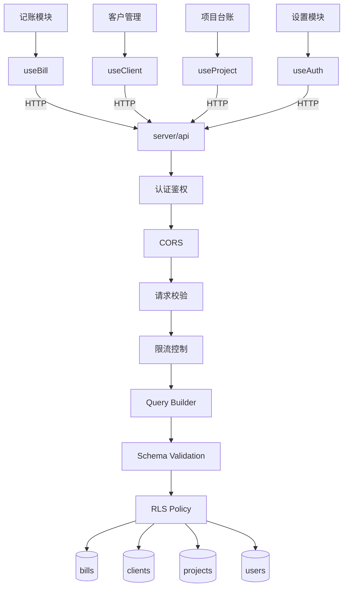
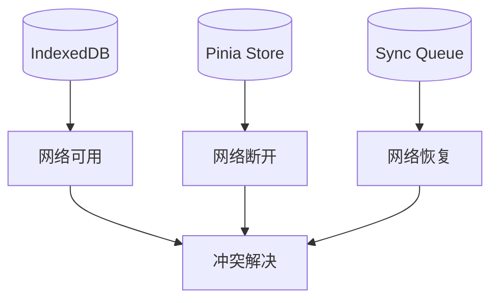
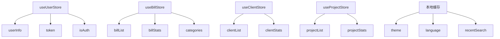
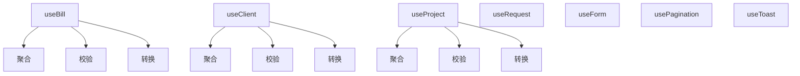
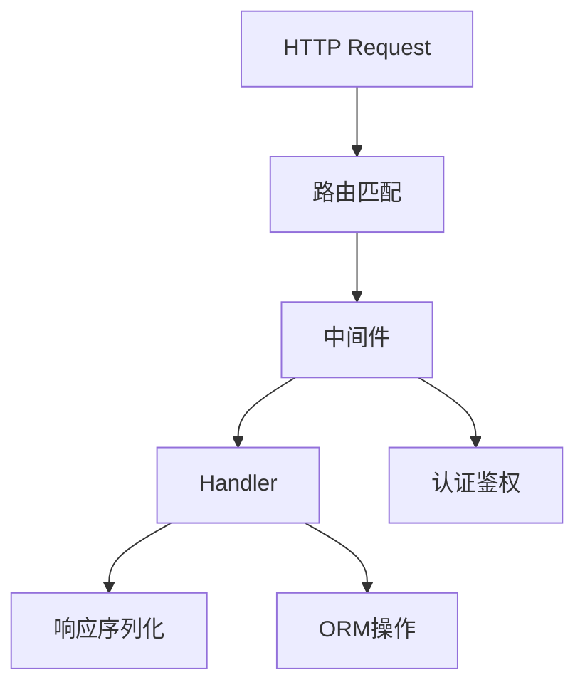
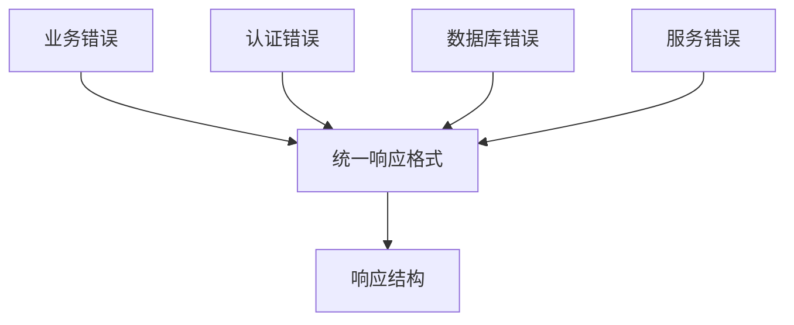

# 数据流图与状态管理设计

本文档详细描述 Palgend 项目的系统数据流和客户端状态管理架构。

## 1. 系统整体数据流

### 1.1 请求响应流程



### 1.2 离线数据同步流程



## 2. 客户端状态管理架构

### 2.1 Pinia Store 整体架构



### 2.2 各模块 Store 设计

#### 2.2.1 用户认证状态 (useUserStore)

```typescript
// app/stores/user.ts
export const useUserStore = defineStore('user', () => {
  // 状态定义
  const userInfo = ref<UserInfo | null>(null)
  const token = ref<string | null>(null)
  const isAuthenticated = computed(() => !!token.value)

  // 持久化配置
  const persistedState = useLocalStorage('pnd-user', {
    token: null,
    userInfo: null,
  })

  // 初始化
  const init = () => {
    token.value = persistedState.value.token
    userInfo.value = persistedState.value.userInfo
  }

  // 登录
  const login = async (credentials: LoginDTO) => {
    const data = await $fetch('/api/auth/login', {
      method: 'POST',
      body: credentials,
    })
    token.value = data.token
    userInfo.value = data.user
    persistedState.value = { token: data.token, userInfo: data.user }
  }

  // 登出
  const logout = () => {
    token.value = null
    userInfo.value = null
    persistedState.value = { token: null, userInfo: null }
  }

  return { userInfo, token, isAuthenticated, init, login, logout }
})
```

#### 2.2.2 记账模块状态 (useBillStore)

```typescript
// app/stores/bill.ts
export const useBillStore = defineStore('bill', () => {
  // 状态定义
  const bills = ref<Bill[]>([])
  const currentBill = ref<Bill | null>(null)
  const loading = ref(false)

  // 统计数据
  const stats = computed(() => ({
    totalIncome: bills.value.filter(b => b.type === 'income').reduce((sum, b) => sum + b.amount, 0),
    totalExpense: bills.value.filter(b => b.type === 'expense').reduce((sum, b) => sum + b.amount, 0),
    balance: 0, // 计算属性
  }))

  // 获取账单列表
  const fetchBills = async (params?: BillQueryDTO) => {
    loading.value = true
    try {
      const data = await $fetch('/api/bills', { params })
      bills.value = data.items
      return data
    } finally {
      loading.value = false
    }
  }

  // 创建账单
  const createBill = async (bill: CreateBillDTO) => {
    const data = await $fetch('/api/bills', {
      method: 'POST',
      body: bill,
    })
    bills.value.unshift(data)
    return data
  }

  // 更新账单
  const updateBill = async (id: string, bill: UpdateBillDTO) => {
    const data = await $fetch(`/api/bills/${id}`, {
      method: 'PUT',
      body: bill,
    })
    const index = bills.value.findIndex(b => b.id === id)
    if (index !== -1) {
      bills.value[index] = data
    }
    return data
  }

  // 删除账单
  const deleteBill = async (id: string) => {
    await $fetch(`/api/bills/${id}`, { method: 'DELETE' })
    bills.value = bills.value.filter(b => b.id !== id)
  }

  return {
    bills,
    currentBill,
    loading,
    stats,
    fetchBills,
    createBill,
    updateBill,
    deleteBill,
  }
})
```

#### 2.2.3 客户管理状态 (useClientStore)

```typescript
// app/stores/client.ts
export const useClientStore = defineStore('client', () => {
  // 状态定义
  const clients = ref<Client[]>([])
  const currentClient = ref<Client | null>(null)
  const loading = ref(false)
  const filters = ref<ClientFilters>({
    status: 'all',
    search: '',
  })

  // 过滤后的客户列表
  const filteredClients = computed(() => {
    return clients.value.filter(client => {
      const matchStatus = filters.value.status === 'all' || client.status === filters.value.status
      const matchSearch = !filters.value.search ||
        client.name.includes(filters.value.search) ||
        client.phone.includes(filters.value.search)
      return matchStatus && matchSearch
    })
  })

  // 获取客户列表
  const fetchClients = async (params?: ClientQueryDTO) => {
    loading.value = true
    try {
      const data = await $fetch('/api/clients', { params })
      clients.value = data.items
      return data
    } finally {
      loading.value = false
    }
  }

  // 创建客户
  const createClient = async (client: CreateClientDTO) => {
    const data = await $fetch('/api/clients', {
      method: 'POST',
      body: client,
    })
    clients.value.unshift(data)
    return data
  }

  // 更新客户
  const updateClient = async (id: string, client: UpdateClientDTO) => {
    const data = await $fetch(`/api/clients/${id}`, {
      method: 'PUT',
      body: client,
    })
    const index = clients.value.findIndex(c => c.id === id)
    if (index !== -1) {
      clients.value[index] = data
    }
    return data
  }

  // 删除客户
  const deleteClient = async (id: string) => {
    await $fetch(`/api/clients/${id}`, { method: 'DELETE' })
    clients.value = clients.value.filter(c => c.id !== id)
  }

  return {
    clients,
    currentClient,
    loading,
    filters,
    filteredClients,
    fetchClients,
    createClient,
    updateClient,
    deleteClient,
  }
})
```

#### 2.2.4 项目台账状态 (useProjectStore)

```typescript
// app/stores/project.ts
export const useProjectStore = defineStore('project', () => {
  // 状态定义
  const projects = ref<Project[]>([])
  const currentProject = ref<Project | null>(null)
  const loading = ref(false)
  const activeTab = ref<'all' | 'ongoing' | 'completed'>('all')

  // 按状态过滤的项目
  const filteredProjects = computed(() => {
    if (activeTab.value === 'all') return projects.value
    return projects.value.filter(p => p.status === activeTab.value)
  })

  // 项目统计
  const stats = computed(() => ({
    total: projects.value.length,
    ongoing: projects.value.filter(p => p.status === 'ongoing').length,
    completed: projects.value.filter(p => p.status === 'completed').length,
    totalAmount: projects.value.reduce((sum, p) => sum + p.amount, 0),
  }))

  // 获取项目列表
  const fetchProjects = async (params?: ProjectQueryDTO) => {
    loading.value = true
    try {
      const data = await $fetch('/api/projects', { params })
      projects.value = data.items
      return data
    } finally {
      loading.value = false
    }
  }

  // 创建项目
  const createProject = async (project: CreateProjectDTO) => {
    const data = await $fetch('/api/projects', {
      method: 'POST',
      body: project,
    })
    projects.value.unshift(data)
    return data
  }

  // 更新项目
  const updateProject = async (id: string, project: UpdateProjectDTO) => {
    const data = await $fetch(`/api/projects/${id}`, {
      method: 'PUT',
      body: project,
    })
    const index = projects.value.findIndex(p => p.id === id)
    if (index !== -1) {
      projects.value[index] = data
    }
    return data
  }

  // 删除项目
  const deleteProject = async (id: string) => {
    await $fetch(`/api/projects/${id}`, { method: 'DELETE' })
    projects.value = projects.value.filter(p => p.id !== id)
  }

  return {
    projects,
    currentProject,
    loading,
    activeTab,
    filteredProjects,
    stats,
    fetchProjects,
    createProject,
    updateProject,
    deleteProject,
  }
})
```

### 2.3 状态持久化策略

```typescript
// app/plugins/pinia-persist.client.ts
export default defineNuxtPlugin(() => {
  // Pinia 持久化配置
  const pinia = usePinia()

  pinia.use(({ store }) => {
    // 只需要持久化这些 store
    const persistStores = ['user', 'settings']

    if (!persistStores.includes(store.$id)) return

    // 从 localStorage 恢复状态
    const storedState = localStorage.getItem(`pnd-${store.$id}`)
    if (storedState) {
      store.$patch(JSON.parse(storedState))
    }

    // 监听状态变化并持久化
    store.$subscribe((_, state) => {
      localStorage.setItem(`pnd-${store.$id}`, JSON.stringify(state))
    })
  })
})
```

## 3. Composables 层设计

### 3.1 Composables 与 Store 关系



### 3.2 业务逻辑 Composables 示例

```typescript
// app/composables/useBill.ts
export const useBill = () => {
  const billStore = useBillStore()
  const toast = useToast()

  // 验证账单数据
  const validateBill = (bill: CreateBillDTO): boolean => {
    if (!bill.amount || bill.amount <= 0) {
      toast.show('请输入正确的金额')
      return false
    }
    if (!bill.category) {
      toast.show('请选择分类')
      return false
    }
    if (!bill.date) {
      toast.show('请选择日期')
      return false
    }
    return true
  }

  // 创建账单（带验证）
  const createBill = async (bill: CreateBillDTO) => {
    if (!validateBill(bill)) return null
    try {
      const result = await billStore.createBill(bill)
      toast.show('记账成功')
      return result
    } catch (error: any) {
      toast.show(error.message || '记账失败')
      return null
    }
  }

  // 按月份获取账单
  const fetchByMonth = async (year: number, month: number) => {
    const startDate = `${year}-${String(month).padStart(2, '0')}-01`
    const endDate = `${year}-${String(month).padStart(2, '0')}-31`
    return billStore.fetchBills({ startDate, endDate })
  }

  // 导出月度账单
  const exportMonthReport = async (year: number, month: number) => {
    await billStore.fetchByMonth(year, month)
    const report = generateReport(billStore.bills)
    downloadExcel(report)
  }

  return {
    // 直接暴露 Store 状态
    bills: billStore.bills,
    stats: billStore.stats,
    loading: billStore.loading,

    // 业务方法
    fetchBills: billStore.fetchBills,
    createBill,
    updateBill: billStore.updateBill,
    deleteBill: billStore.deleteBill,
    fetchByMonth,
    exportMonthReport,
  }
}
```

## 4. 服务端数据流

### 4.1 请求生命周期



### 4.2 服务端中间件链

```typescript
// server/middleware/01.auth.ts
export default defineEventHandler(async (event) => {
  // 公开路径（无需认证）
  const publicPaths = ['/api/auth/login', '/api/auth/register', '/api/health']

  // 获取请求路径
  const path = getRequestURL(event).pathname

  // 公开路径直接通过
  if (publicPaths.some(p => path.startsWith(p))) {
    return
  }

  // 获取 Token
  const token = getHeader(event, 'Authorization')?.replace('Bearer ', '')

  if (!token) {
    throw createError({
      statusCode: 401,
      message: '未登录，请先登录',
    })
  }

  // 验证 Token
  const payload = verifyToken(token)
  if (!payload) {
    throw createError({
      statusCode: 401,
      message: 'Token 无效或已过期',
    })
  }

  // 将用户信息挂载到 event.context
  event.context.user = payload
})

// server/middleware/02.cors.ts
export default defineCors(event, {
  origin: process.env.CORS_ORIGIN || '*',
  methods: ['GET', 'POST', 'PUT', 'DELETE'],
  credentials: true,
})
```

## 5. 数据库访问层

### 5.1 Drizzle ORM 使用模式

```typescript
// server/db/index.ts
import { drizzle } from 'drizzle-orm/neon-http'
import { neon } from '@neondatabase/serverless'
import * as schema from './schema'

const sql = neon(process.env.DATABASE_URL!)
export const db = drizzle(sql, { schema })
```

### 5.2 Repository 模式

```typescript
// server/db/repositories/bill.repository.ts
export class BillRepository {
  // 查询账单列表
  async findAll(userId: string, params: BillQueryDTO) {
    const { items, total } = await db.query.bills.findMany({
      where: and(
        eq(schema.bills.userId, userId),
        params.startDate ? gte(schema.bills.date, params.startDate) : undefined,
        params.endDate ? lte(schema.bills.date, params.endDate) : undefined,
        params.type ? eq(schema.bills.type, params.type) : undefined,
      ),
      orderBy: [desc(schema.bills.date), desc(schema.bills.createdAt)],
      limit: params.limit || 20,
      offset: params.offset || 0,
    })
    return { items, total }
  }

  // 创建账单
  async create(userId: string, data: CreateBillDTO) {
    const [bill] = await db.insert(schema.bills).values({
      ...data,
      userId,
    }).returning()
    return bill
  }

  // 更新账单
  async update(id: string, userId: string, data: UpdateBillDTO) {
    const [bill] = await db.update(schema.bills)
      .set(data)
      .where(and(eq(schema.bills.id, id), eq(schema.bills.userId, userId)))
      .returning()
    return bill
  }

  // 删除账单
  async delete(id: string, userId: string) {
    await db.delete(schema.bills)
      .where(and(eq(schema.bills.id, id), eq(schema.bills.userId, userId)))
  }
}

export const billRepository = new BillRepository()
```

## 6. 数据一致性保证

### 6.1 事务处理

```typescript
// server/api/projects/[id].put.ts
export default defineEventHandler(async (event) => {
  const id = getRouterParam(event, 'id')
  const userId = event.context.user.id
  const body = await readBody(event)

  // 使用事务确保数据一致性
  return await db.transaction(async (tx) => {
    // 更新项目状态
    const [project] = await tx.update(schema.projects)
      .set({
        ...body,
        updatedAt: new Date(),
      })
      .where(and(
        eq(schema.projects.id, id),
        eq(schema.projects.userId, userId)
      ))
      .returning()

    // 如果项目完成，同步更新关联客户的项目统计
    if (body.status === 'completed' && project.clientId) {
      await tx.update(schema.clients)
        .set({ updatedAt: new Date() })
        .where(eq(schema.clients.id, project.clientId))
    }

    return project
  })
})
```

### 6.2 RLS 行级安全策略

```sql
-- 启用行级安全策略
ALTER TABLE bills ENABLE ROW LEVEL SECURITY;
ALTER TABLE clients ENABLE ROW LEVEL SECURITY;
ALTER TABLE projects ENABLE ROW LEVEL SECURITY;

-- 创建策略：用户只能访问自己的数据
CREATE POLICY "Users can only access their own bills"
  ON bills FOR ALL
  USING (user_id = current_user_id());

CREATE POLICY "Users can only access their own clients"
  ON clients FOR ALL
  USING (user_id = current_user_id());

CREATE POLICY "Users can only access their own projects"
  ON projects FOR ALL
  USING (user_id = current_user_id());
```

## 7. 错误处理流程



---

## 附录：类型定义

```typescript
// shared/types/index.ts

// 用户信息
export interface UserInfo {
  id: string
  email: string
  name: string
  createdAt: string
}

// 账单类型
export interface Bill {
  id: string
  userId: string
  type: 'income' | 'expense'
  amount: number
  category: string
  description?: string
  date: string
  createdAt: string
  updatedAt: string
}

// 客户类型
export interface Client {
  id: string
  userId: string
  name: string
  phone?: string
  email?: string
  company?: string
  status: 'active' | 'inactive'
  createdAt: string
  updatedAt: string
}

// 项目类型
export interface Project {
  id: string
  userId: string
  clientId?: string
  name: string
  description?: string
  amount: number
  status: 'ongoing' | 'completed' | 'cancelled'
  startDate?: string
  endDate?: string
  createdAt: string
  updatedAt: string
}
```
