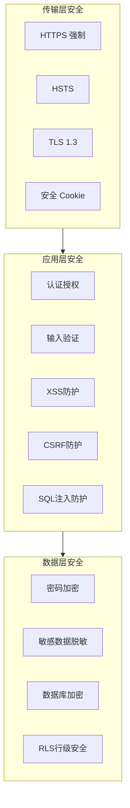

# 安全设计文档

本文档详细描述 Palgend 项目的安全策略和防护措施，包括输入验证、XSS 防护、CSRF 防护、数据加密等。

## 1. 安全策略概述

### 1.1 防护层次



### 1.2 安全检查清单

| 类别 | 检查项 | 状态 |
|------|--------|------|
| 传输安全 | HTTPS 强制 | ✅ |
| 传输安全 | HSTS 头 | ✅ |
| 认证授权 | JWT Token 安全 | ✅ |
| 输入验证 | Zod Schema 验证 | ✅ |
| XSS 防护 | Content-Type Options | ✅ |
| XSS 防护 | CSP Content Security Policy | ✅ |
| CSRF 防护 | SameSite Cookie | ✅ |
| SQL 注入 | Parameterized Queries | ✅ |
| 密码安全 | bcrypt 加密 | ✅ |
| 敏感数据 | 脱敏处理 | ✅ |

---

## 2. 传输层安全

### 2.1 HTTPS 强制

```typescript
// nuxt.config.ts
export default defineNuxtConfig({
  runtimeConfig: {
    // ...
  },

  // 生产环境强制 HTTPS
  routeRules: {
    '/**': {
      headers: process.env.NODE_ENV === 'production' ? {
        'Strict-Transport-Security': 'max-age=31536000; includeSubDomains',
        'X-Frame-Options': 'SAMEORIGIN',
      } : {},
    },
  },
})
```

### 2.2 安全响应头

```typescript
// server/middleware/03.security.ts
export default defineEventHandler((event) => {
  // 设置安全响应头
  setResponseHeaders(event, {
    // 防止 XSS
    'X-Content-Type-Options': 'nosniff',
    'X-XSS-Protection': '1; mode=block',

    // 防止点击劫持
    'X-Frame-Options': 'SAMEORIGIN',

    // Content Security Policy
    'Content-Security-Policy': [
      "default-src 'self'",
      "script-src 'self' 'unsafe-inline'",
      "style-src 'self' 'unsafe-inline'",
      "img-src 'self' data: https:",
      "font-src 'self'",
      "connect-src 'self'",
      "frame-ancestors 'none'",
    ].join('; '),

    // Referrer Policy
    'Referrer-Policy': 'strict-origin-when-cross-origin',

    // Permissions Policy
    'Permissions-Policy': 'camera=(), microphone=(), geolocation=()',
  })
})
```

---

## 3. 输入验证

### 3.1 Zod Schema 验证

所有用户输入都必须通过 Zod 进行验证：

```typescript
// shared/validations/bill.validation.ts
import { z } from 'zod'

export const createBillSchema = z.object({
  type: z.enum(['income', 'expense'], {
    required_error: '请选择账单类型',
    invalid_type_error: '账单类型无效',
  }),
  amount: z.number({
    required_error: '请输入金额',
    invalid_type_error: '金额必须是数字',
  }).positive('金额必须大于 0').max(9999999999.99, '金额超出最大范围'),
  category: z.string().min(1, '请选择分类'),
  description: z.string().max(500, '备注最多500字').optional(),
  date: z.string().regex(/^\d{4}-\d{2}-\d{2}$/, '日期格式错误'),
})

export type CreateBillInput = z.infer<typeof createBillSchema>
```

```typescript
// shared/validations/client.validation.ts
import { z } from 'zod'

export const createClientSchema = z.object({
  name: z.string()
    .min(1, '请输入客户姓名')
    .max(50, '姓名最多50字'),
  phone: z.string()
    .regex(/^1[3-9]\d{9}$/, '请输入正确的手机号')
    .optional()
    .or(z.literal('')),
  email: z.string()
    .email('请输入正确的邮箱')
    .optional()
    .or(z.literal('')),
  company: z.string().max(200, '公司名称最多200字').optional(),
  address: z.string().max(500, '地址最多500字').optional(),
  remark: z.string().max(1000, '备注最多1000字').optional(),
})

export type CreateClientInput = z.infer<typeof createClientSchema>
```

```typescript
// shared/validations/project.validation.ts
import { z } from 'zod'

export const createProjectSchema = z.object({
  name: z.string()
    .min(1, '请输入项目名称')
    .max(200, '项目名称最多200字'),
  description: z.string().max(2000, '描述最多2000字').optional(),
  clientId: z.string().optional(),
  amount: z.number().min(0, '金额不能为负').optional(),
  status: z.enum(['ongoing', 'completed', 'cancelled']).optional(),
  progress: z.number().min(0).max(100).optional(),
  startDate: z.string().regex(/^\d{4}-\d{2}-\d{2}$/).optional(),
  endDate: z.string().regex(/^\d{4}-\d{2}-\d{2}$/).optional(),
})

export type CreateProjectInput = z.infer<typeof createProjectSchema>
```

### 3.2 验证中间件

```typescript
// server/middleware/02.validation.ts
import { z } from 'zod'

export const validateBody = <T>(schema: z.ZodSchema<T>) => {
  return defineEventHandler(async (event) => {
    const body = await readBody(event)

    const result = schema.safeParse(body)

    if (!result.success) {
      const errors = result.error.errors.map(err => ({
        field: err.path.join('.'),
        message: err.message,
      }))

      throw createError({
        statusCode: 400,
        message: result.error.errors[0].message,
        data: { errors },
      })
    }

    // 将验证后的数据挂载到 event.context
    event.context.validatedBody = result.data
  })
}

export const validateQuery = <T>(schema: z.ZodSchema<T>) => {
  return defineEventHandler(async (event) => {
    const query = getQuery(event)

    const result = schema.safeParse(query)

    if (!result.success) {
      throw createError({
        statusCode: 400,
        message: result.error.errors[0].message,
      })
    }

    event.context.validatedQuery = result.data
  })
}
```

---

## 4. API 限流策略

### 4.1 限流配置

```typescript
// server/middleware/02.ratelimit.ts
import { createRateLimit } from 'unstorage'
import { useStorage } from '#imports'

export default defineEventHandler(async (event) => {
  const storage = useStorage()
  const clientIp = getRequestIP(event)
  const path = getRequestURL(event).pathname
  
  // 公开路径不限制
  const publicPaths = ['/api/auth/login', '/api/auth/register', '/api/health']
  if (publicPaths.some(p => path.startsWith(p))) {
    return
  }
  
  // 限流配置
  const rateLimitConfig = {
    windowMs: 15 * 60 * 1000, // 15分钟
    max: 100, // 每个IP最多100次请求
    message: '请求过于频繁，请稍后再试',
  }
  
  const key = `rate-limit:${clientIp}`
  const current = await storage.getItem(key) as number || 0
  
  if (current >= rateLimitConfig.max) {
    throw createError({
      statusCode: 429,
      message: rateLimitConfig.message,
    })
  }
  
  // 增加计数
  await storage.setItem(key, current + 1)
  
  // 设置过期时间
  setTimeout(async () => {
    await storage.removeItem(key)
  }, rateLimitConfig.windowMs)
})
```

### 4.2 登录接口特殊限流

```typescript
// server/api/auth/login.post.ts
export default defineEventHandler(async (event) => {
  const body = await readBody(event)
  const clientIp = getRequestIP(event)
  
  // 登录失败限流
  const failKey = `login-fail:${clientIp}:${body.email}`
  const failCount = await useStorage().getItem(failKey) as number || 0
  
  if (failCount >= 5) {
    throw createError({
      statusCode: 429,
      message: '登录失败次数过多，请稍后再试',
    })
  }
  
  // ... 验证逻辑
  
  // 登录失败增加计数
  await useStorage().setItem(failKey, failCount + 1)
  
  // 5分钟后重置
  setTimeout(async () => {
    await useStorage().removeItem(failKey)
  }, 5 * 60 * 1000)
})
```

---

## 5. 日志审计

### 5.1 操作日志记录

```typescript
// server/middleware/04.logger.ts
export default defineEventHandler(async (event) => {
  const startTime = Date.now()
  const path = getRequestURL(event).pathname
  const method = getMethod(event)
  
  // 跳过健康检查和静态资源
  if (path === '/api/health' || path.startsWith('/_nuxt/') || path.startsWith('/favicon')) {
    return
  }
  
  try {
    await next(event)
  } finally {
    const duration = Date.now() - startTime
    const statusCode = event.response?.status || 200
    const userId = event.context.user?.id || 'anonymous'
    
    // 记录操作日志
    await useStorage().setItem(`audit:${Date.now()}`, {
      timestamp: new Date().toISOString(),
      userId,
      path,
      method,
      statusCode,
      duration,
      clientIp: getRequestIP(event),
      userAgent: getHeader(event, 'user-agent'),
    })
    
    // 只保留最近30天的日志
    const thirtyDaysAgo = Date.now() - 30 * 24 * 60 * 60 * 1000
    const keys = await useStorage().getKeys('audit:')
    for (const key of keys) {
      if (parseInt(key.split(':')[1]) < thirtyDaysAgo) {
        await useStorage().removeItem(key)
      }
    }
  }
})
```

---

## 6. XSS 防护

### 6.1 HTML 转义

```typescript
// shared/utils/sanitize.ts

// HTML 特殊字符转义
const escapeHtml = (str: string): string => {
  const htmlEscapes: Record<string, string> = {
    '&': '&amp;',
    '<': '&lt;',
    '>': '&gt;',
    '"': '&quot;',
    "'": '&#39;',
  }

  return str.replace(/[&<>"']/g, char => htmlEscapes[char])
}

// 允许的 HTML 标签白名单
const ALLOWED_TAGS = ['b', 'i', 'em', 'strong', 'a', 'br']

// 简单的富文本过滤（生产环境建议使用 DOMPurify）
export const sanitizeHtml = (html: string): string => {
  // 移除所有标签，只保留纯文本
  return html.replace(/<[^>]*>/g, '').trim()
}

// URL 白名单验证
export const isAllowedUrl = (url: string): boolean => {
  try {
    const parsed = new URL(url)
    return ['http:', 'https:'].includes(parsed.protocol)
  } catch {
    return false
  }
}
```

### 4.2 Vue 自动转义

Nuxt/Vue 默认会对模板中的动态内容进行 HTML 转义，只需确保：

```vue
<!-- 安全的写法：Vue 会自动转义 -->
<template>
  <div v-html="sanitizedContent"></div>
</template>

<!-- 需要手动转义的内容 -->
<script setup>
const userInput = '<script>alert("XSS")</script>'
// Vue 默认会转义
</script>
```

---

## 5. CSRF 防护

### 5.1 SameSite Cookie

```typescript
// server/utils/cookies.ts
import { setCookie, getCookie } from 'h3'

export const setAuthCookie = (event: any, token: string, refreshToken: string) => {
  // Access Token Cookie
  setCookie(event, 'auth_token', token, {
    httpOnly: true,      // 防止 XSS 访问
    secure: true,         // 仅 HTTPS 传输
    sameSite: 'strict',   // CSRF 防护
    maxAge: 7 * 24 * 60 * 60, // 7天
    path: '/',
  })

  // Refresh Token Cookie
  setCookie(event, 'refresh_token', refreshToken, {
    httpOnly: true,
    secure: true,
    sameSite: 'strict',
    maxAge: 30 * 24 * 60 * 60, // 30天
    path: '/',
  })
}
```

### 5.2 CSRF Token（可选，用于表单提交）

```typescript
// server/api/csrf-token.get.ts
export default defineEventHandler(async (event) => {
  const csrfToken = crypto.randomUUID()

  // 存储到 session 或 Redis
  await db.insert(csrfTokens).values({
    token: csrfToken,
    userId: event.context.user?.id,
    expiresAt: new Date(Date.now() + 60 * 60 * 1000), // 1小时
  })

  return {
    code: 0,
    data: { csrfToken },
  }
})
```

---

## 6. SQL 注入防护

### 6.1 Drizzle ORM 参数化查询

Drizzle 默认使用参数化查询，自动防止 SQL 注入：

```typescript
// ✅ 安全的写法：Drizzle 参数化查询
const bills = await db.select().from(schema.bills)
  .where(eq(schema.bills.userId, userId))

// ✅ 支持复杂查询
const result = await db.select().from(schema.bills)
  .where(
    and(
      eq(schema.bills.userId, userId),
      eq(schema.bills.type, type),
      gte(schema.bills.date, startDate)
    )
  )

// ❌ 绝对禁止：字符串拼接 SQL
// const result = await db.execute(sql`SELECT * FROM bills WHERE user_id = ${userId}`)
```

### 6.2 Schema 验证

```typescript
// server/db/schema/bills.ts
export const bills = pgTable('bills', {
  id: text('id').primaryKey(),
  userId: text('user_id').notNull(),

  // Drizzle 会自动验证类型，防止注入
  type: text('type').notNull(),
  amount: decimal('amount', { precision: 12, scale: 2 }).notNull(),
  category: text('category').notNull(),
  // ...
})
```

---

## 7. 敏感数据处理

### 7.1 密码加密

```typescript
// server/utils/password.ts
import bcrypt from 'bcrypt'

const SALT_ROUNDS = 12

export const hashPassword = async (password: string): Promise<string> => {
  return await bcrypt.hash(password, SALT_ROUNDS)
}

export const verifyPassword = async (password: string, hash: string): Promise<boolean> => {
  return await bcrypt.compare(password, hash)
}
```

### 7.2 敏感字段脱敏

```typescript
// shared/utils/mask.ts

// 手机号脱敏：138****8000
export const maskPhone = (phone: string): string => {
  if (!phone || phone.length < 7) return phone
  return phone.slice(0, 3) + '****' + phone.slice(-4)
}

// 邮箱脱敏：a***@example.com
export const maskEmail = (email: string): string => {
  if (!email) return email
  const [name, domain] = email.split('@')
  if (!domain) return email
  const maskedName = name.slice(0, 2) + '***'
  return maskedName + '@' + domain
}

// 身份证脱敏：110***********1234
export const maskIdCard = (idCard: string): string => {
  if (!idCard || idCard.length < 10) return idCard
  return idCard.slice(0, 3) + '***********' + idCard.slice(-4)
}

// 银行卡脱敏：**** **** **** 1234
export const maskBankCard = (cardNumber: string): string => {
  if (!cardNumber) return cardNumber
  return '**** **** **** ' + cardNumber.slice(-4)
}
```

### 7.3 日志脱敏

```typescript
// server/utils/logger.ts
import { maskEmail, maskPhone } from '~/shared/utils/mask'

export const logRequest = (event: any) => {
  const body = event.body

  // 脱敏敏感字段后再记录日志
  if (body?.password) body.password = '[REDACTED]'
  if (body?.email) body.email = maskEmail(body.email)
  if (body?.phone) body.phone = maskPhone(body.phone)

  console.log({
    method: event.method,
    path: event.path,
    body,
    timestamp: new Date().toISOString(),
  })
}
```

---

## 8. 限流防护

### 8.1 API 限流

```typescript
// server/middleware/04.rate-limit.ts

interface RateLimitRecord {
  count: number
  resetTime: number
}

const rateLimitMap = new Map<string, RateLimitRecord>()

// 清理过期记录
setInterval(() => {
  const now = Date.now()
  for (const [key, record] of rateLimitMap.entries()) {
    if (now > record.resetTime) {
      rateLimitMap.delete(key)
    }
  }
}, 60 * 60 * 1000) // 每小时清理

export default defineEventHandler(async (event) => {
  const ip = getRequestIP(event) || 'unknown'
  const path = getRequestURL(event).pathname

  // 不同接口不同的限流策略
  const limits: Record<string, { max: number; window: number }> = {
    '/api/auth/login': { max: 5, window: 5 * 60 * 1000 },      // 登录：5次/5分钟
    '/api/auth/register': { max: 3, window: 10 * 60 * 1000 }, // 注册：3次/10分钟
    '/api/bills': { max: 100, window: 60 * 1000 },             // 账单：100次/分钟
    '/api/clients': { max: 100, window: 60 * 1000 },
    '/api/projects': { max: 100, window: 60 * 1000 },
    '/default': { max: 200, window: 60 * 1000 },                // 默认：200次/分钟
  }

  const limit = limits[path] || limits['/default']
  const key = `${ip}:${path}`

  const record = rateLimitMap.get(key)

  if (record) {
    if (Date.now() > record.resetTime) {
      rateLimitMap.set(key, { count: 1, resetTime: Date.now() + limit.window })
    } else {
      record.count++
      if (record.count > limit.max) {
        throw createError({
          statusCode: 429,
          message: '请求过于频繁，请稍后再试',
          headers: {
            'Retry-After': String(Math.ceil((record.resetTime - Date.now()) / 1000)),
          },
        })
      }
    }
  } else {
    rateLimitMap.set(key, { count: 1, resetTime: Date.now() + limit.window })
  }
})
```

---

## 9. Vercel 边缘函数安全

### 9.1 Edge Runtime 配置

```typescript
// server/api/bills/index.get.ts
export default defineEventHandler(async (event) => {
  // 边缘函数安全配置
  if (process.env.EDGE_RUNTIME) {
    // 检查 Edge Runtime 环境变量
    if (!event.context.user) {
      throw createError({
        statusCode: 401,
        message: 'Unauthorized',
      })
    }
  }

  // 业务逻辑...
})
```

### 9.2 环境变量安全

```typescript
// nuxt.config.ts
export default defineNuxtConfig({
  runtimeConfig: {
    // 公开变量（客户端可访问）
    public: {
      apiBase: process.env.NUXT_PUBLIC_API_BASE,
    },

    // 私有变量（仅服务端访问）
    jwtSecret: process.env.JWT_SECRET,
    databaseUrl: process.env.DATABASE_URL,
  },
})
```

**注意**：敏感配置不要放在 `runtimeConfig.public` 中：

```typescript
// ❌ 错误：敏感信息放在 public
runtimeConfig: {
  public: {
    jwtSecret: process.env.JWT_SECRET, // 不安全！
  }
}

// ✅ 正确：敏感信息放在私有区域
runtimeConfig: {
  jwtSecret: process.env.JWT_SECRET, // 安全
}
```

---

## 10. 安全检查清单

### 10.1 开发阶段

- [x] 所有用户输入使用 Zod 验证
- [x] 密码使用 bcrypt 加密存储
- [x] 使用参数化查询防止 SQL 注入
- [x] 敏感数据在日志中脱敏
- [x] API 接口限流
- [x] 设置安全响应头

### 10.2 部署阶段

- [ ] 启用 HTTPS
- [ ] 配置 HSTS
- [ ] 设置环境变量密钥
- [ ] 启用数据库 RLS
- [ ] 配置 WAF 防火墙
- [ ] 设置监控告警

### 10.3 运维阶段

- [ ] 定期更新依赖
- [ ] 安全漏洞扫描
- [ ] 日志审计
- [ ] 备份验证

---

## 附录：安全响应头说明

| 响应头 | 说明 | 推荐值 |
|--------|------|--------|
| Strict-Transport-Security | 强制 HTTPS | `max-age=31536000; includeSubDomains` |
| X-Content-Type-Options | 防止 MIME 嗅探 | `nosniff` |
| X-Frame-Options | 防止点击劫持 | `SAMEORIGIN` 或 `DENY` |
| X-XSS-Protection | XSS 过滤器 | `1; mode=block` |
| Content-Security-Policy | 内容安全策略 | 根据需求配置 |
| Referrer-Policy | Referrer 策略 | `strict-origin-when-cross-origin` |
| Permissions-Policy | 权限策略 | 按需启用功能 |
